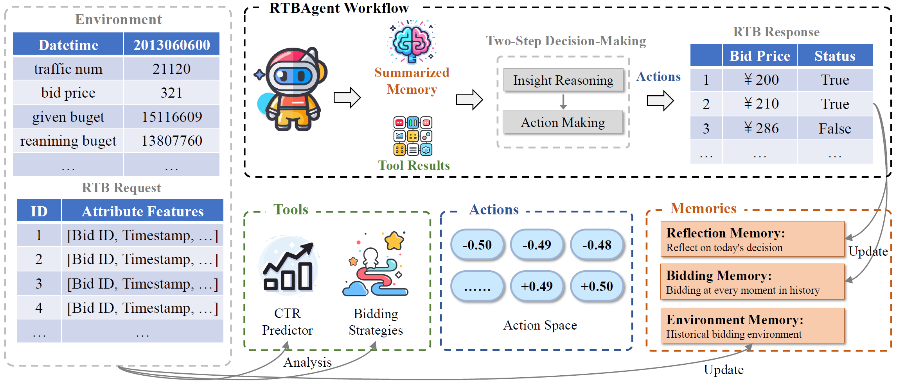
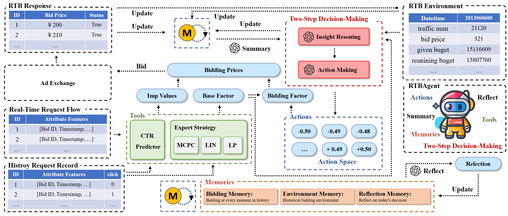
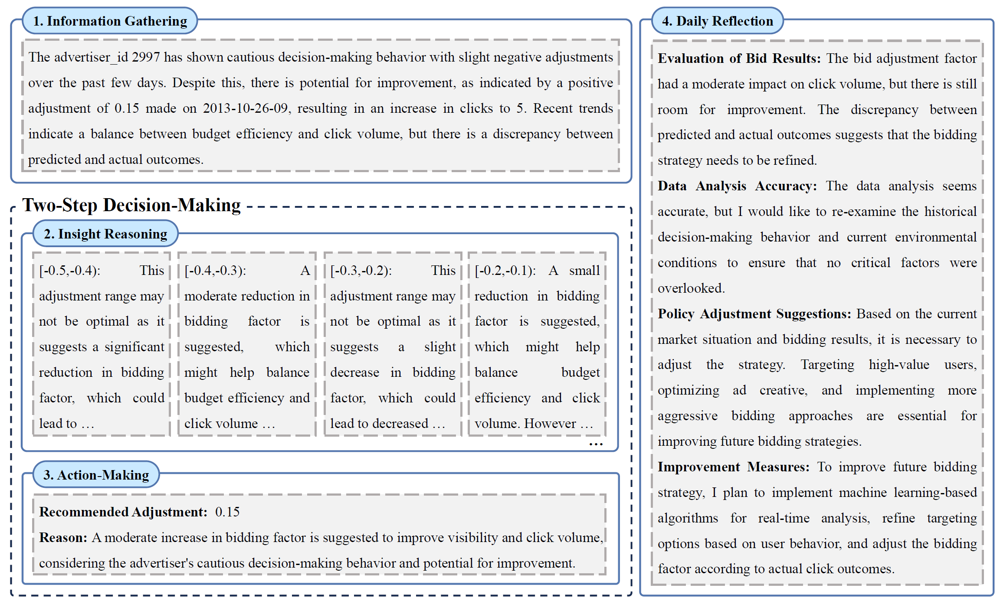

# RTBAgent: A LLM-based Agent System for Real-Time Bidding
PyTorch implementation for [WWW'2025] "RTBAgent: A LLM-based Agent System for Real-Time Bidding"

## Overall Framework
 

## Detail Workflow
 

## Example of Reasoning Process 

   
## Dataset Preparation
The benchmark dataset employed in our experiments is the publicly available iPinYou dataset. For comprehensive guidance on obtaining and preprocessing the iPinYou RTB data, we kindly refer the reader to the open-source repository [`make-ipinyou-data`](https://github.com/wnzhang/make-ipinyou-data).

## CTR Prediction
For the build of the CTR prediction model, you can refer to [`RLBid_EA`](https://github.com/hzn666/RLBid_EA)

## LLM API Set
Use the environment variable os.environ['MY_API_PARAM'] to set the API parameter for the process. 

## Requirements
- Python 3.9
- PyTorch 2.5.1
- CUDA 12.3 
- MetaGPT v0.7
- Other requirements are listed in `requirements.txt`. 

